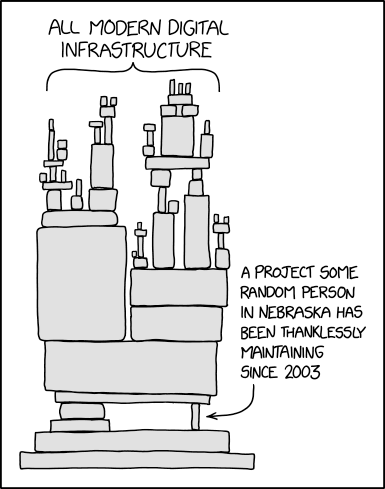

## Security Risks in your Cloud-Native Stack

Every year OWASP publishes their Top 10 Most Critical Web Application Security Risks, in 2025 Software Supply Chain Failures were moved up to the third pace (from 6th), and now share the top three among Broken Acess Control and Security Misconfigurations ([OWASP 2025 Report](https://owasp.org/Top10/2025/0x00_2025-Introduction/)).

Software Supply Chain describes the entirety of physical and software components involved in creating a product.

The modern cloud infrastructure and applications are build on open source software, with 96% of codebases containing free and open source software (Linux Foundation, CITE TODO).
The perpetual reuse of open source software has many advantages, such as transparency, cost-efficiency, and flexibility just to name a few.

Open source software unfortunately also comes with downsides, many of the used base images come with known vulnerabilities (especially if not regularly updated), and they may include hidden dependencies (typically dependencies of dependencies...).

Many of the open source projects are underfunded, aren't regularly updated and 32% of them are in a neglected state ([Orca 2025 State of Coud Security Report](https://orca.security/lp/2025-state-of-cloud-security-report/)).
Therefore, many of them accumulate CVEs (common vulnerabiities and exposures).

## How does Chainguard help?

An innovative solution to this problem relies on a fundamentally different approach to building container images. The key lies in providing minimal, secure operating systems, such as Wolfi, developed by Chainguard.

A wide variety of open source images are created on this minimal foundation. These images contain only the building blocks needed to build the software. The attack surface is dramatically reduced in these minimal images. The upstream code is compiled from scratch every day. This allows the latest versions of all dependencies to be integrated and ensures complete documentation. This allows the latest versions of all dependencies to be integrated and ensures complete documentation.  Complete SBOMs (Software Bill of Materials) are also provided, which contain clear evidence and origin information for each image. The images are tested for consistent behavior and rebuilt daily. The result of this process is container images with ∼0 CVEs.

The Chainguard catalog includes over 1800 secure alternatives to common open source images. Beyond container images, the catalog is continuously expanding and now also includes libraries (beta) and VM images (early access). Chainguard also offers solutions for replacing images that are no longer freely available and Helm charts from Bitnami and Minio.
