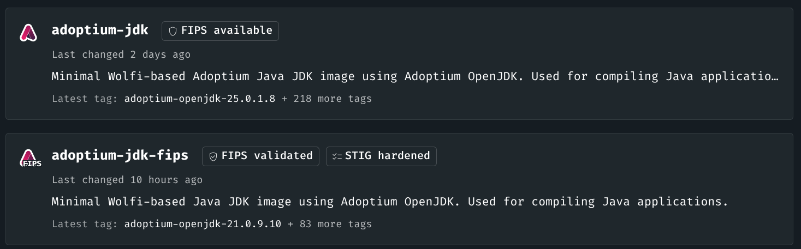
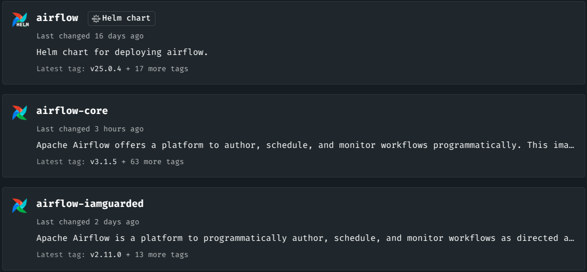
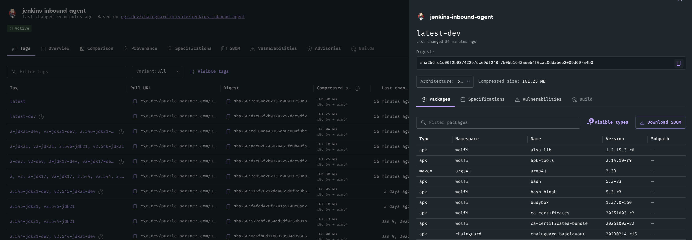
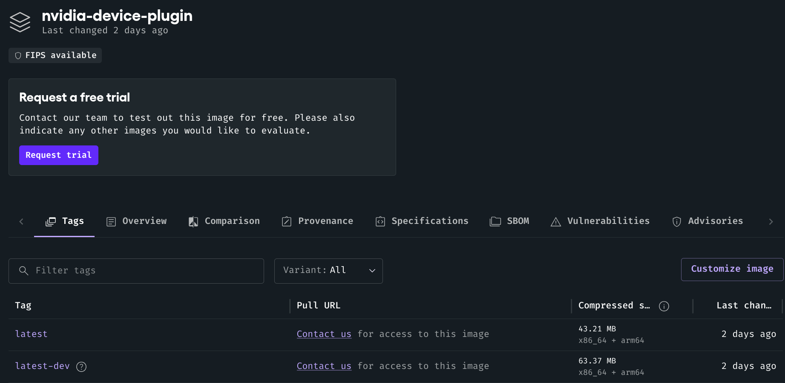

## Different Chainguard images

Chainguard offers container images, virtual machine (VM) images, helm charts and libraries.

### Container images

Chainguard offers a wide variety of container images.
Let's check out the different types:

#### FIPS images

In the image directory of Chainguard some images are tagged with ´FIPS validated´. These images comply strict cryptographic requirements to be used for the U.S. federal agencies, defense contractors, and regulated industries.

#### iamguarded images

If the image has the "-iamguarded" in its name, it is composed to be a base image for a Helm Chart.

#### Tags and Digests

While the images are rebuild nightly, the image tags (for example ´jenkins:2.546-jdk21´) stay the same, but the underlying "digests" of its dependencies might update to account for security patches (for example ´git:2.52.0-r1´). You can check out these digests by selecting the image and reviewing the included packages.

When the official image tag version is increased, the previous security patches are either amended or rebased on the new tag version. Keeping the Chainguard image en par with the official updates but still patching the security vulnerabilities.

##### dev images

The dev image version can be found as an additional tagged version.

This image version includes a few more tools such as a shell and the apk package manager (bash, git, wget, apk-tools, BusyBox), that will help you when developing, building and debugging applications. It is designed to be used  during the developement and build process.

The recommended pattern is to use a dev image during the build stage, install dependencies or perform compilation there, and then copy only the required files into a distroless production image. This ensures the final runtime environment is as minimal and hardened as possible.

